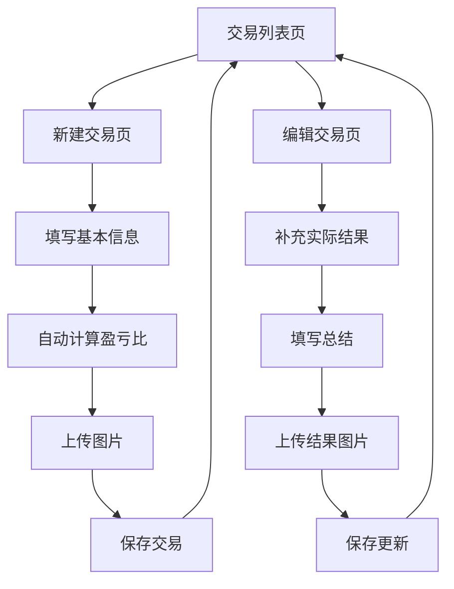

## 1. 产品概述
一个本地部署的交易记录网站，帮助用户记录和管理交易信息。用户可以创建新交易记录，填写交易详情，上传相关图片，并按年月分组查看历史交易。

目标用户为个人交易者，通过系统化的记录帮助分析交易表现，提升交易技能。

## 2. 核心功能

### 2.1 用户角色
本系统为单用户系统，无需注册登录功能。

### 2.2 功能模块
交易记录网站包含以下主要页面：
1. **交易列表页**：左侧年月分组标签，右侧交易记录卡片列表
2. **新建交易页**：填写交易基本信息，自动计算盈亏比
3. **编辑交易页**：补充实际交易结果和总结

### 2.3 页面详情

| 页面名称 | 模块名称 | 功能描述 |
|-----------|-------------|---------------------|
| 交易列表页 | 年月分组导航 | 按年份和月份分组显示，支持快速切换不同时间段 |
| 交易列表页 | 交易卡片列表 | 以卡片形式展示交易记录，显示币种、状态、盈亏情况等关键信息 |
| 交易列表页 | 交易筛选 | 支持按币种、盈亏状态等条件筛选交易记录 |
| 新建交易页 | 基本信息填写 | 输入币种、时间、入场价、开单理由、预期止损价、预期止盈价 |
| 新建交易页 | 盈亏比计算 | 根据预期止损价和预期止盈价自动计算预期盈亏比 |
| 新建交易页 | 图片上传 | 上传交易相关的图片文件 |
| 编辑交易页 | 实际结果填写 | 补充实际止盈价或止损价、实际盈亏（含手续费） |
| 编辑交易页 | 交易总结 | 填写本单交易的总结和经验教训 |
| 编辑交易页 | 结果图片上传 | 上传交易结果相关的图片文件 |

## 3. 核心流程

### 用户操作流程
1. 用户进入交易列表页，查看所有交易记录
2. 点击左侧年月标签，切换到特定时间段的交易
3. 点击"新建交易"按钮，进入新建交易页面
4. 填写交易基本信息，系统自动计算盈亏比
5. 上传相关图片，保存交易记录
6. 在列表页点击交易卡片，进入编辑页面
7. 补充实际交易结果和总结，上传结果图片
8. 保存后返回列表页查看更新后的交易状态

## 4. 用户界面设计

### 4.1 设计风格
- **主色调**：深绿色（#1a3a2e）作为背景色
- **辅助色**：浅绿色（#4a7c59）用于卡片和按钮
- **文字颜色**：白色（#ffffff）和浅灰色（#e0e0e0）
- **按钮样式**：圆角矩形，悬停时有轻微阴影效果
- **字体**：无衬线字体，主要文字14-16px，标题18-24px
- **布局风格**：左侧垂直导航，右侧卡片列表布局
- **图标风格**：简洁的线性图标，与整体暗色主题协调

### 4.2 页面设计概览

| 页面名称 | 模块名称 | UI元素 |
|-----------|-------------|-------------|
| 交易列表页 | 年月分组导航 | 左侧垂直标签栏，深绿色背景，选中状态高亮显示，支持滚动 |
| 交易列表页 | 交易卡片 | 圆角矩形卡片，显示币种、时间、状态标签、盈亏金额，悬停时有阴影效果 |
| 新建交易页 | 表单区域 | 分组显示的输入框，标签文字为浅绿色，输入框为深灰色背景 |
| 新建交易页 | 盈亏比显示 | 大字体显示计算结果，盈利为绿色，亏损为红色 |
| 编辑交易页 | 结果输入区 | 与基本信息区分组显示，包含实际盈亏计算 |

### 4.3 响应式设计
采用桌面端优先设计，适配不同屏幕尺寸：
- 桌面端：左侧固定宽度导航，右侧自适应内容区域
- 平板端：导航栏可收起，卡片布局调整为两列
- 移动端：导航栏变为顶部标签，卡片单列显示

## 5. 数据存储要求
- 交易数据以JSON格式保存在项目文件夹的data目录下
- 每个交易记录包含唯一ID，按时间顺序存储
- 图片文件保存在项目文件夹的images目录下，按交易ID组织子文件夹
- 支持数据备份和恢复功能