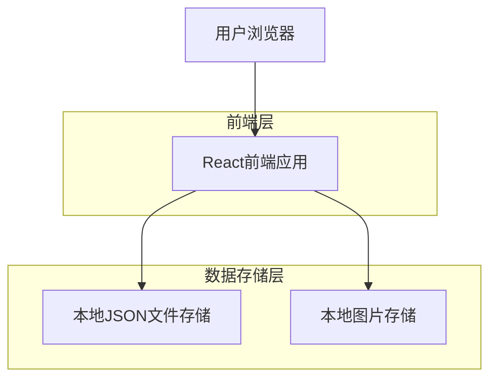

## 1. 架构设计



## 2. 技术描述

* **前端**: React\@18 + Vite + Tailwind CSS

* **初始化工具**: vite-init

* **状态管理**: React Context + useReducer

* **图片处理**: 浏览器File API + Base64编码

* **数据存储**: 本地JSON文件读写（通过File System Access API）

* **后端**: 无（纯前端应用）

## 3. 路由定义

| 路由              | 用途               |
| --------------- | ---------------- |
| /               | 交易列表页，显示所有交易记录   |
| /trade/new      | 新建交易页，创建新的交易记录   |
| /trade/:id/edit | 编辑交易页，更新现有交易记录   |
| /trade/:id      | 交易详情页，查看单个交易完整信息 |

## 4. 数据模型定义

### 4.1 交易记录类型

```typescript
interface TradeRecord {
  id: string;
  symbol: string;           // 币种/交易品种
  entryTime: string;        // 入场时间
  entryPrice: number;       // 入场价格
  reason: string;          // 开单理由
  expectedStopLoss: number; // 预期止损价
  expectedTakeProfit: number; // 预期止盈价
  expectedRRRatio: number;   // 预期盈亏比（自动计算）
  
  // 实际结果（编辑时填写）
  actualExitPrice?: number; // 实际出场价格
  actualProfitLoss?: number; // 实际盈亏（含手续费）
  summary?: string;          // 交易总结
  
  // 图片信息
  entryImage?: string;       // 入场时图片（Base64或文件名）
  exitImage?: string;       // 出场时图片（Base64或文件名）
  
  // 状态信息
  status: 'open' | 'closed'; // 交易状态
  createdAt: string;        // 创建时间
  updatedAt: string;        // 更新时间
}

interface TradeGroup {
  year: number;
  month: number;
  trades: TradeRecord[];
}
```

### 4.2 组件状态类型

```typescript
interface AppState {
  trades: TradeRecord[];
  currentFilter: {
    year?: number;
    month?: number;
    symbol?: string;
    status?: 'open' | 'closed' | 'all';
  };
  isLoading: boolean;
  error: string | null;
}

interface TradeFormData {
  symbol: string;
  entryTime: string;
  entryPrice: string;
  reason: string;
  expectedStopLoss: string;
  expectedTakeProfit: string;
  entryImage?: File;
}

interface TradeEditData {
  actualExitPrice: string;
  actualProfitLoss: string;
  summary: string;
  exitImage?: File;
}
```

## 5. 文件存储结构

```
project-root/
├── data/
│   └── trades.json      # 所有交易记录
├── images/
│   ├── {tradeId}/
│   │   ├── entry.jpg    # 入场图片
│   │   └── exit.jpg     # 出场图片
│   └── temp/           # 临时图片文件
└── src/
    ├── components/     # React组件
    ├── hooks/         # 自定义Hook
    ├── utils/         # 工具函数
    ├── services/      # 数据服务
    └── types/         # TypeScript类型定义
```

## 6. 核心服务函数

### 6.1 数据存储服务

```typescript
// 读取交易数据
async function loadTrades(): Promise<TradeRecord[]>

// 保存交易数据
async function saveTrades(trades: TradeRecord[]): Promise<void>

// 添加新交易
async function addTrade(trade: TradeRecord): Promise<void>

// 更新交易
async function updateTrade(id: string, updates: Partial<TradeRecord>): Promise<void>

// 删除交易
async function deleteTrade(id: string): Promise<void>
```

### 6.2 图片处理服务

```typescript
// 保存图片
async function saveImage(tradeId: string, imageFile: File, type: 'entry' | 'exit'): Promise<string>

// 删除图片
async function deleteImage(tradeId: string, type: 'entry' | 'exit'): Promise<void>

// 图片压缩
function compressImage(file: File, maxWidth: number, maxHeight: number): Promise<string>
```

### 6.3 盈亏比计算工具

```typescript
// 计算预期盈亏比
function calculateRiskRewardRatio(
  entryPrice: number,
  stopLoss: number,
  takeProfit: number
): number {
  const risk = Math.abs(entryPrice - stopLoss);
  const reward = Math.abs(takeProfit - entryPrice);
  return reward / risk;
}
```

## 7. 组件架构

### 7.1 主要组件结构

```
App
├── Layout
│   ├── Sidebar (年月分组导航)
│   └── MainContent
│       ├── TradeList (交易卡片列表)
│       ├── TradeForm (新建/编辑表单)
│       └── TradeDetail (交易详情)
├── components/
│   ├── TradeCard (交易卡片)
│   ├── TradeFilter (筛选器)
│   ├── ImageUpload (图片上传)
│   ├── RRRCalculator (盈亏比计算器)
│   └── StatusBadge (状态标签)
└── hooks/
    ├── useTrades (交易数据管理)
    ├── useImageUpload (图片上传处理)
    └── useLocalStorage (本地存储)
```

## 8. 部署配置

### 8.1 构建配置

* 使用Vite进行项目构建

* 配置静态文件输出路径

* 设置环境变量支持

### 8.2 服务器部署

* 构建后的静态文件可直接部署到任何Web服务器

* 支持Nginx、Apache等主流Web服务器

* 需要配置适当的CORS策略以支持本地文件访问

### 8.3 数据备份策略

* 定期备份data/trades.json文件

* images目录需要完整备份

* 提供数据导出/导入功能用于迁移

